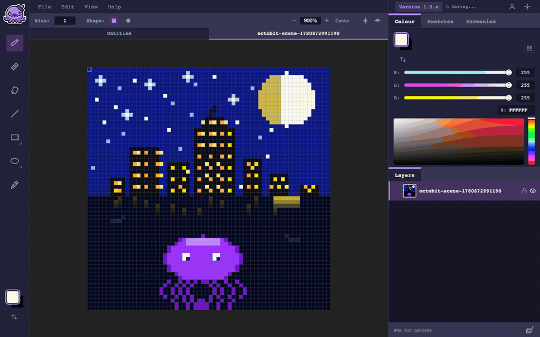
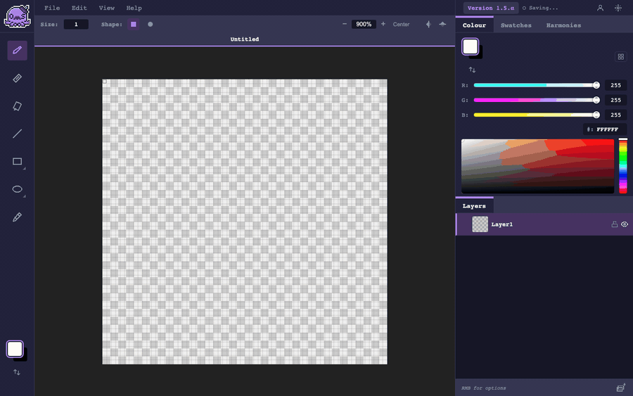
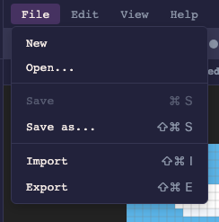
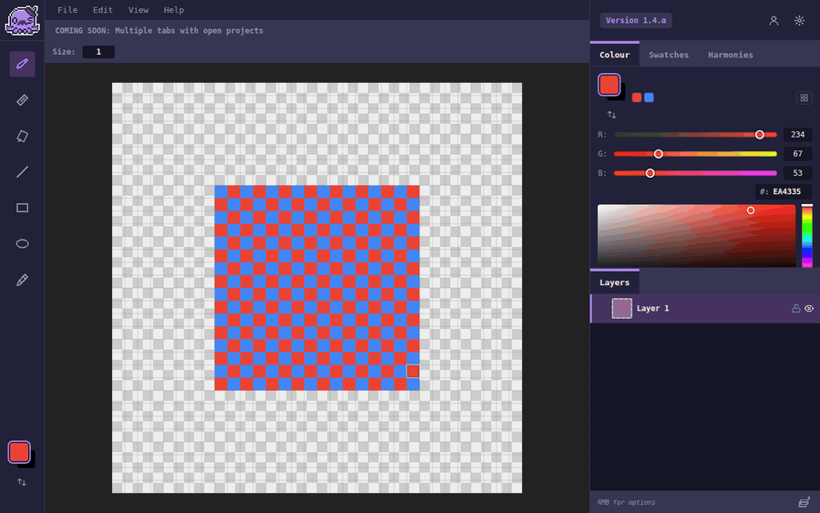
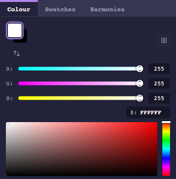
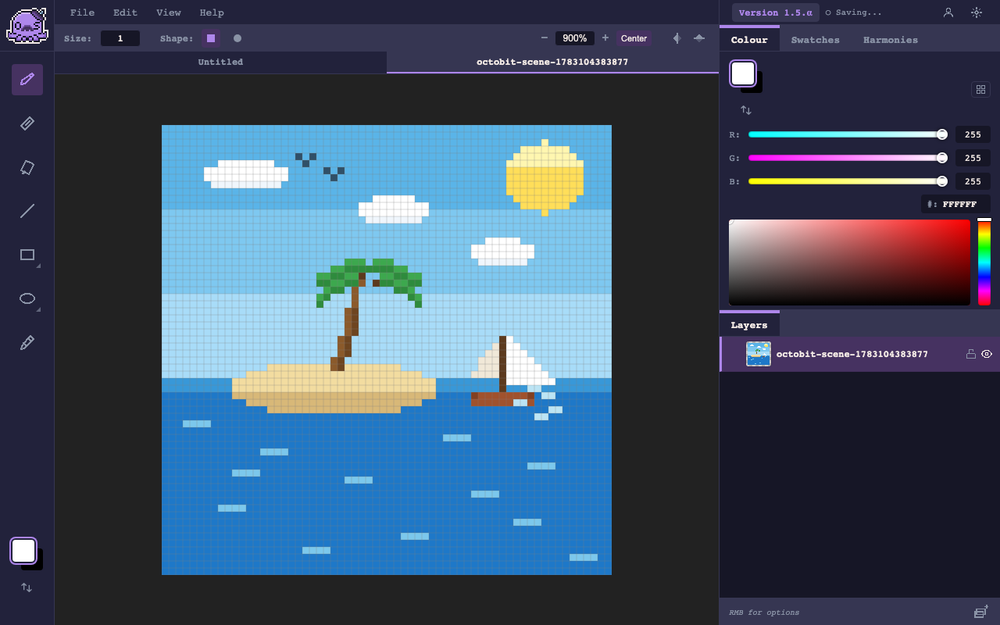
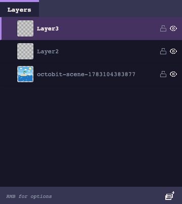

  

  <h1>OctoBit Studio</h1>
  
A pixel art editor that actually feels good to use.

  

    

  
  
  
  

---

  
   A 64×64 tropical island — painted start to finish with OctoBit tools: flood fill, shapes, pencil and line.

No install. No account. No friction. Open the browser and start drawing.

---

## Draw with precision

  

| | Tool | Shortcut |
|--|------|----------|
| ✏️ | Pencil | `Ctrl+B` |
| 🧽 | Eraser | `Ctrl+E` |
| 🪣 | Bucket Fill | `Ctrl+G` |
| 💧 | Eyedropper | `Ctrl+I` |
| 📏 | Line | `Ctrl+L` |
| ⬜ | Rectangle | `Ctrl+R` |
| ⬛ | Fill Rectangle | `Ctrl+R` (toggle) |
| ⭕ | Ellipse | `Ctrl+O` |
| 🔵 | Fill Ellipse | `Ctrl+O` (toggle) |

All tools support adjustable brush size. Rectangle and Ellipse toggle between outline and fill mode via a flyout.

---

## Layers

  

Full layer tree with nested groups — hide, lock, drag & drop reorder, thumbnails auto-cropped to painted area. Flip H/V and merge layers directly from the context menu.

---

## Your projects, your files

  

OctoBit uses its own binary format — **`.octo`** — storing layer pixel data as raw PNG blobs with gzip-compressed metadata. No dependencies, no base64 overhead.

- **File → Save As...** opens your OS native file picker (Chrome, Edge, Brave)
- **File → Open...** loads a `.octo` file back with all layers intact
- The `●` indicator in the project tab shows unsaved changes
- Auto-save to browser storage keeps your work between sessions

---

## Zoom & Navigation

  

Mouse wheel zooms toward cursor. `Space + drag` to pan. Pixel grid appears at ≥ 4×. Zoom controls in the toolbar: `−` / `100%` / `+` / **Center**.

---

## Color

  

Two picker modes: HSV square and HSL triangle. Primary/secondary color widget. Palette system with document palettes, harmonies (complementary, analogous, triadic), and last 10 used colors.

---

## Screenshots

<table>
  <tr>
    <td align="center">
      
       Full editor
    </td>
    <td align="center">
      
       Layers panel
    </td>
  </tr>
  <tr>
    <td align="center">
      
       Color panel
    </td>
    <td align="center">
      
       Tool palette
    </td>
  </tr>
</table>

---

## Under the hood

Built from scratch — no canvas libraries:

- **DocumentEngine** — layer compositor with Canvas Pool (60 FPS, no GC pressure)
- **Bresenham & Zingl** — pixel-perfect lines and ellipses
- **Command pattern** — undo/redo, 50 steps
- **Snapshot-preview** — live shape preview without flicker
- **OctoFormat** — binary `.octo` container, gzip metadata, raw PNG blobs, no dependencies

4 themes: **Octoone** (dark), **Kyoonotay**, **Dracula**, **Light**.

---

## What's next

- [ ] Selection tools (rect, lasso, magic wand)
- [ ] Animation timeline + onion skinning
- [ ] Desktop app (Tauri)

---

  Source code: private &nbsp;·&nbsp; <a href="https://octobit.studio">octobit.studio</a>

